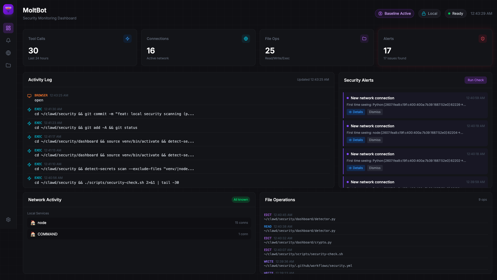

<div align="center">

# 🦀 MoltBot Security Dashboard

**Real-time security monitoring for [molt.bot](https://molt.bot) AI agents**

[](https://opensource.org/licenses/MIT)
[](https://www.python.org/downloads/)

[Features](#features) • [Install](#installation) • [Screenshots](#screenshots) • [Docs](#documentation)

</div>

---

<p align="center">
  
</p>

---

## What is this?

An **optional security layer** for [molt.bot](https://molt.bot) that monitors your AI agent's activity in real-time:

- 👁️ **See everything** your agent does — tool calls, file operations, network connections
- 🚨 **Get alerts** for suspicious patterns — reverse shells, data exfiltration, privilege escalation
- 📊 **Learn baselines** — detects anomalies based on normal behavior patterns
- 🔐 **Encrypted baselines** — optional AES-256-GCM encryption for sensitive environments

This dashboard reads from `~/.clawdbot` (where molt.bot stores session logs) and provides visibility into what your agent is doing.

---

## Installation

### Quick Install

```bash
curl -fsSL https://raw.githubusercontent.com/moltbot/security-dashboard/main/install.sh | bash
```

### Manual Install

```bash
git clone https://github.com/moltbot/security-dashboard.git ~/.moltbot-security
cd ~/.moltbot-security
./setup.sh
```

### Start the Dashboard

```bash
~/.moltbot-security/start
# → http://localhost:5050
```

---

## Features

| Feature | Description |
|---------|-------------|
| **Activity Log** | Real-time feed of all tool calls (exec, read, write, browser, etc.) |
| **Security Alerts** | Pattern matching for dangerous commands + behavioral anomaly detection |
| **Network Monitor** | Active connections with process attribution |
| **File Operations** | Track reads, writes, and edits across the filesystem |
| **Baseline Learning** | Learns "normal" patterns over 24h, flags deviations |
| **Encrypted Storage** | Optional AES-256-GCM encryption for baseline data |

### Detection Patterns

| Threat | Detection |
|--------|-----------|
| Pipe to shell (`curl \| sh`) | Pattern matching |
| Reverse shells | Signature detection |
| Data exfiltration | Network + file analysis |
| Privilege escalation | Command monitoring |
| Sensitive file access | Path monitoring |

---

## Screenshots

<details>
<summary>📊 Main Dashboard</summary>


</details>

---

## Configuration

The dashboard reads from:
- `~/.clawdbot/agents/` — Session logs (JSONL)
- `~/.clawdbot/security/` — Baseline data, settings

### Environment Variables

| Variable | Default | Description |
|----------|---------|-------------|
| `MOLTBOT_PORT` | `5050` | Dashboard port |
| `MOLTBOT_HOST` | `127.0.0.1` | Bind address |
| `CLAWDBOT_DIR` | `~/.clawdbot` | Agent logs directory |

---

## Security

This tool runs **locally only** — no data leaves your machine.

For local vulnerability scanning:
```bash
./scripts/security-check.sh
```

This runs:
- **Bandit** — Python SAST
- **pip-audit** — Dependency vulnerabilities
- **npm audit** — JS dependencies
- **detect-secrets** — Secret detection

---

## Development

```bash
# Setup
./setup.sh

# Run from source
./start.sh

# Build frontend (requires Node.js)
cd dashboard-ui && npm install && npm run build
```

---

## License

MIT — see [LICENSE](LICENSE)

---

<div align="center">

**[molt.bot](https://molt.bot)** — AI agents that work for you

</div>
