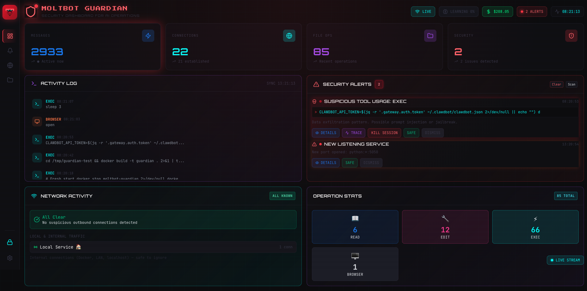

# 🦞 OpenClaw Sentinel

**Monitor your AI agent's behavior, costs, and performance — all in one dashboard.**



---

## What is Sentinel?

Sentinel watches over your OpenClaw AI agent and tells you:

- 💰 **How much you're spending** — Track tokens and costs by day
- ⚡ **How well it's performing** — Task completion, response speed, tool reliability
- 🧠 **How it's behaving** — Self-corrections, user sentiment, context health
- 🔒 **If anything looks risky** — Security alerts for sensitive operations
- 📊 **Memory usage** — Vector search stats and indexing status

---

## Quick Start

### Option 1: Docker (Recommended)

```bash
docker run -d \
  --name sentinel \
  -p 5056:5056 \
  -v ~/.openclaw:/data/.openclaw:ro \
  -v sentinel-data:/app/data \
  -e OPENCLAW_GATEWAY_URL=ws://host.docker.internal:18789 \
  -e OPENCLAW_GATEWAY_TOKEN=your-token-here \
  ghcr.io/jfr992/openclaw-sentinel:latest
```

Open **http://localhost:5056** in your browser.

> **Note:** Replace `your-token-here` with your OpenClaw gateway token for real-time events.

### Option 2: Run Locally

```bash
git clone https://github.com/jfr992/openclaw-sentinel.git
cd openclaw-sentinel
npm install
npm start
```

Open **http://localhost:5056** in your browser.

---

## Features at a Glance

| Tab | What it Shows |
|-----|---------------|
| **Usage** | Tokens, costs, cache efficiency, daily trends |
| **Memory** | Indexed files, chunks, vector search status |
| **Performance** | Task completion %, response time, tool success rate |
| **Security** | Risk alerts, suspicious commands, credential access |
| **Insights** | Self-correction score, user sentiment, context health |

---

## The Dashboard

### Header Controls

- 🔄 **Refresh** — Manually refresh data
- ⬆️ **Import** — Import historical data from session files
- 🟢 **Online/Offline** — Gateway connection status

### Date Range Picker

Select a time range to filter historical data:
- **1H, 6H, 24H** — Short-term view
- **7D, 14D, 30D** — Weekly/monthly trends
- **Custom** — Pick specific dates

---

## Understanding the Metrics

### Usage Tab
- **Total Tokens** — Input + output tokens used
- **Cache Hit** — % of requests served from cache (higher = cheaper)
- **Total Cost** — Estimated spend in USD
- **Messages** — Total conversation turns

### Performance Tab
- **Overall Score** — 0-100 rating of agent performance
- **Task Completion** — % of tasks completed successfully
- **Response Latency** — Average response time
- **Tool Success** — % of tool calls that succeeded
- **Memory Retrieval** — How often memory is accessed
- **Proactive Actions** — Self-initiated helpful actions

### Insights Tab
- **Self-Correction Score** — Lower is better (fewer mistakes)
- **User Sentiment** — How satisfied users seem (from message tone)
- **Context Health** — Conversation continuity (higher = fewer context losses)

### Security Tab
- **Risk Level** — 0 (none) to 4 (critical)
- **Alerts** — Suspicious operations detected
- **Actions** — Acknowledge or dismiss alerts

---

## Data Storage

Sentinel stores metrics in a local SQLite database:
- **Location**: `./data/metrics.db` (native) or `/app/data/metrics.db` (Docker)
- **Retention**: 30 days by default
- **Sync**: Every 5 minutes automatically

To persist data in Docker, use a volume:
```bash
-v sentinel-data:/app/data
```

---

## Importing Historical Data

Click the **⬆️ Import** button to re-sync all historical data from your OpenClaw session files. This is useful when:
- First setting up Sentinel
- After upgrading versions
- If data seems incomplete

---

## Troubleshooting

### Dashboard shows "Offline"
- Check if OpenClaw Gateway is running (`openclaw status`)
- Verify the gateway URL and token in environment variables

### Memory tab shows "Not Found"
- Ensure `~/.openclaw` is mounted in Docker
- Check that OpenClaw has indexed some files

### Metrics seem outdated
- Click the Refresh button
- Or run Import to re-sync from session files

---

## For Developers

See the [docs/](docs/) folder for:
- [Architecture Overview](docs/ARCHITECTURE.md)
- [API Reference](docs/API.md)
- [Configuration Options](docs/CONFIGURATION.md)
- [Contributing Guide](docs/CONTRIBUTING.md)

---

## License

MIT License — See [LICENSE](LICENSE) for details.

---

Built with 🦞 by the OpenClaw community.
