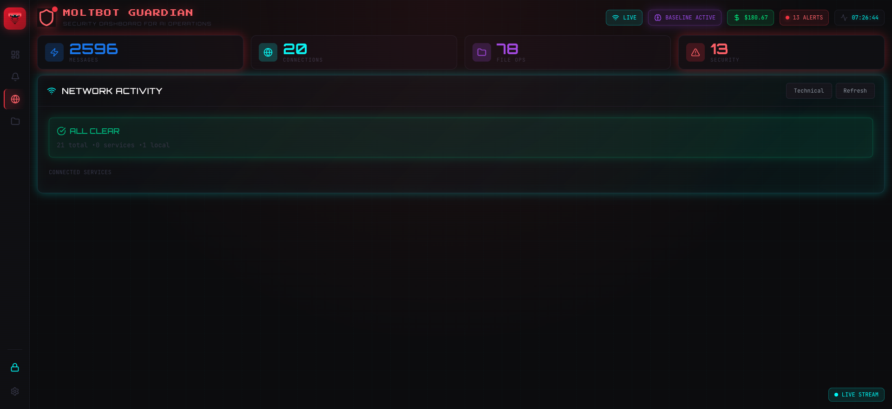

<div align="center">

# 🦀 MoltBot Guardian

**Real-time security dashboard for AI agent operations**

[](https://github.com/jfr992/moltbot-security-dashboard/actions/workflows/ci.yml)
[](https://github.com/jfr992/moltbot-security-dashboard/pkgs/container/moltbot-guardian)
[](LICENSE)

</div>

---

## 📸 Screenshots

### Network Activity Monitor

*Real-time connection monitoring with threat detection*

---

## ✨ Features

### 🚨 Security Alerts
- Detects reverse shells, data exfiltration, privilege escalation
- Pattern-based threat intelligence (50+ suspicious domains, 30+ dangerous ports)
- One-click **Kill Session** to terminate suspicious agents

### 📊 Behavioral Baseline
- Learns normal patterns over time
- Flags anomalies automatically
- Configurable sensitivity thresholds

### 🌐 Network Monitoring
- Real-time connection tracking
- Hostname resolution with threat analysis
- Detects tunneling services (ngrok, serveo), mining pools, C2 patterns

### 📁 File Operations
- **Counters by type:** 📖 Read, ✏️ Write, 🔧 Edit, ⚡ Exec, 💬 Message, 🖥️ Browser
- **Time filters:** Last 1h, 6h, 24h, or All Time
- Full activity log with timestamps

### ⚡ Live Updates
- WebSocket connection to Clawdbot gateway
- Real-time metrics and alerts
- Polling fallback when WebSocket unavailable

### 🔐 Security Features
- Encrypted baseline storage (AES-256-GCM)
- No external data transmission
- Local-only operation

---

## 🚀 Quick Start

### Docker (Recommended)

```bash
docker run -d --name moltbot-guardian \
  -p 5050:5050 \
  -v ~/.clawdbot:/data:ro \
  -e CLAWDBOT_API_TOKEN="your-token" \
  ghcr.io/jfr992/moltbot-guardian:latest
```

### Docker Compose

```bash
# Clone the repo
git clone https://github.com/jfr992/moltbot-security-dashboard.git
cd moltbot-security-dashboard

# Start with your Clawdbot token
CLAWDBOT_API_TOKEN=$(jq -r '.gateway.auth.token' ~/.clawdbot/clawdbot.json) \
  docker-compose up -d
```

**Dashboard:** http://localhost:5050

---

## ⚙️ Configuration

| Variable | Default | Description |
|----------|---------|-------------|
| `MOLTBOT_PORT` | `5050` | Dashboard port |
| `CLAWDBOT_DIR` | `/data` (Docker) or `~/.clawdbot` | Agent session logs |
| `CLAWDBOT_URL` | `ws://host.docker.internal:18789` | Gateway WebSocket URL |
| `CLAWDBOT_API_TOKEN` | - | Gateway auth token (required for kill) |

---

## 🔧 Development

```bash
# Setup environment
./dev.sh setup

# Run locally (frontend + backend)
./dev.sh start

# Run linting & security checks
./dev.sh lint

# Build Docker image
./dev.sh docker
```

---

## 📊 API Endpoints

| Endpoint | Description |
|----------|-------------|
| `GET /api/health` | Health check |
| `GET /api/activity` | Recent tool calls, connections, messages |
| `GET /api/alerts` | Security alerts |
| `GET /api/network/detailed` | Full network analysis with threats |
| `POST /api/sessions/kill` | Kill/reset agent session |
| `GET /api/baseline` | Behavioral baseline stats |

---

## 🏗️ Architecture

```
┌─────────────────────────────────────────────────────────┐
│                    MoltBot Guardian                      │
├─────────────────────────────────────────────────────────┤
│  React UI (Vite)     │  Flask API + SocketIO            │
│  ├─ Dashboard        │  ├─ Session parser               │
│  ├─ Alerts Panel     │  ├─ Security detector            │
│  ├─ Network Panel    │  ├─ Threat intelligence          │
│  └─ File Operations  │  ├─ Baseline learning            │
│                      │  └─ Gateway WebSocket client     │
├─────────────────────────────────────────────────────────┤
│  Data Sources                                            │
│  ├─ ~/.clawdbot/agents/*.jsonl (session logs)           │
│  ├─ Gateway WebSocket (live events)                     │
│  └─ lsof / /proc/net (network connections)              │
└─────────────────────────────────────────────────────────┘
```

---

## 📜 License

MIT License - See [LICENSE](LICENSE) for details.

---

<div align="center">

**Built for [Clawdbot](https://github.com/clawdbot/clawdbot)** 🦀

</div>
